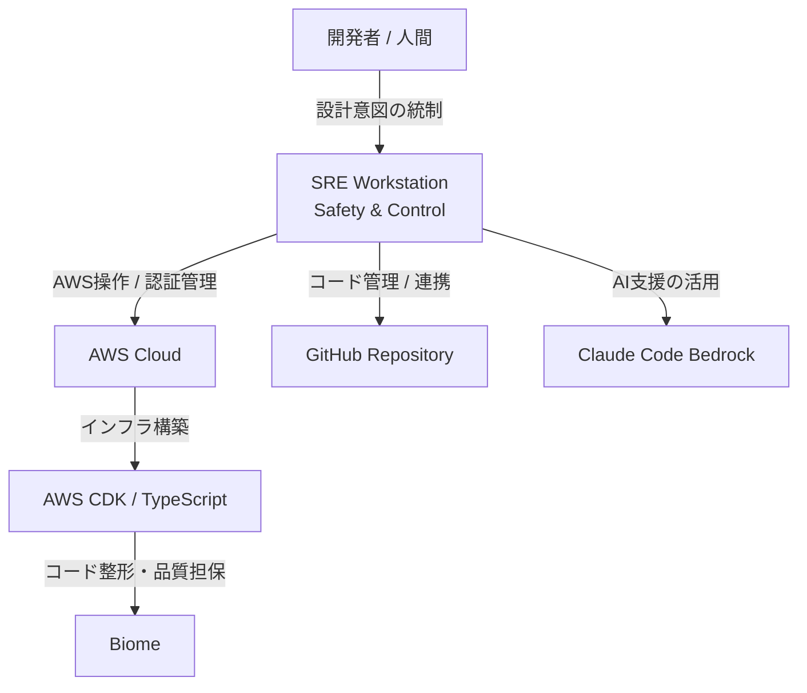
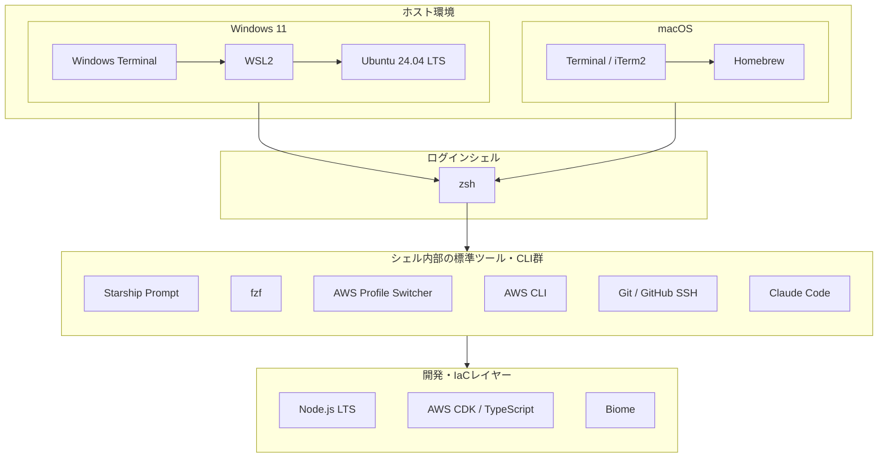

# SRE Workstation Setup

## 再現性と安全性に妥協しない、プロフェッショナルSREのための標準開発環境構築ガイド

本リポジトリでは、AWS運用におけるヒューマンエラーの排除、複数環境の厳格な分離、そしてAIの処理能力を安全に最大化するためのワークステーション構成を定義します。

---

## Philosophy / 哲学

SREにとって、課題と感じるのは、ツールの導入数でも、設定の煩雑さでもありません。<br>
私たちが直面するのは常に以下の問いです。

- **破壊的なオペレーションの抑止**：開発環境のつもりで、本番環境にデプロイをしていないか？
- **認知的負荷の軽減**：今、自分がどの権限で、どのリージョンのどのリソースを触っているか即座に把握できているか？
- **再現性の担保**：個人のスキルや端末の差異に依存した、属人化された環境になっていないか？

本リポジトリでは、これらのリスクを「個人の注意力」ではなく**「強制力のある構造と可視化」**によって解決するためのスタンダードを定義していくことを試みるものです。

---

## Goal / 目指す環境（開発・運用ワークフロー）



---

# Supported Platforms & Recommended Environment

本リポジトリでは、各OS上に以下のツール群（zsh, Starship, fzf, AWS CLI, Claude Code, Biome 等）を構築し、一貫した開発体験と安全性を担保することを推奨環境として定義しています。

## Windows 推奨環境

- **ベース基盤**: `Windows 11` + `Windows Terminal` + `WSL2` (`Ubuntu 24.04 LTS`)
- **導入ツール群**: `zsh`, `Starship`, `fzf`, `AWS Profile Switcher`, `AWS CLI`, `Git`, `Claude Code`, `Node.js (LTS)`, `AWS CDK`, `TypeScript`, `Biome`
- セットアップ手順：`docs/windows.md`

## macOS 推奨環境

- **ベース基盤**: `macOS` + `Homebrew`
- **導入ツール群**: `zsh`, `Starship`, `fzf`, `AWS Profile Switcher`, `AWS CLI`, `Git`, `Claude Code`, `Node.js (LTS)`, `AWS CDK`, `TypeScript`, `Biome`
- セットアップ手順：`docs/macos.md`

---

# Standard Components

本環境で利用する標準コンポーネント

```text
Windows Terminal
WSL2
Ubuntu 24.04 LTS
zsh
Starship
fzf
AWS Profile Switcher
AWS CLI
Git
GitHub SSH
Claude Code
Node.js (LTS)
AWS CDK
TypeScript
Biome
```

---

# Architecture




